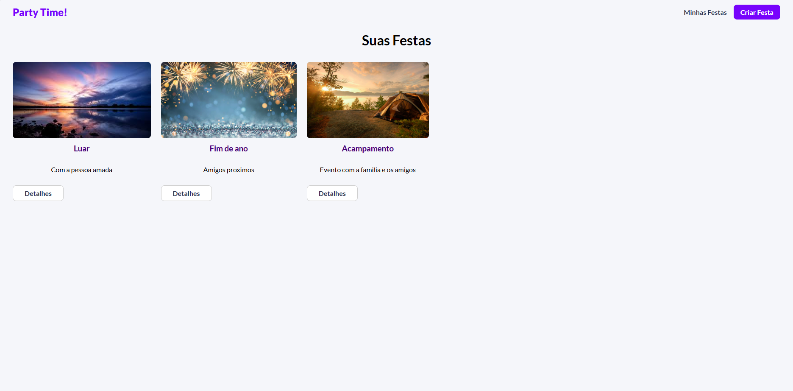
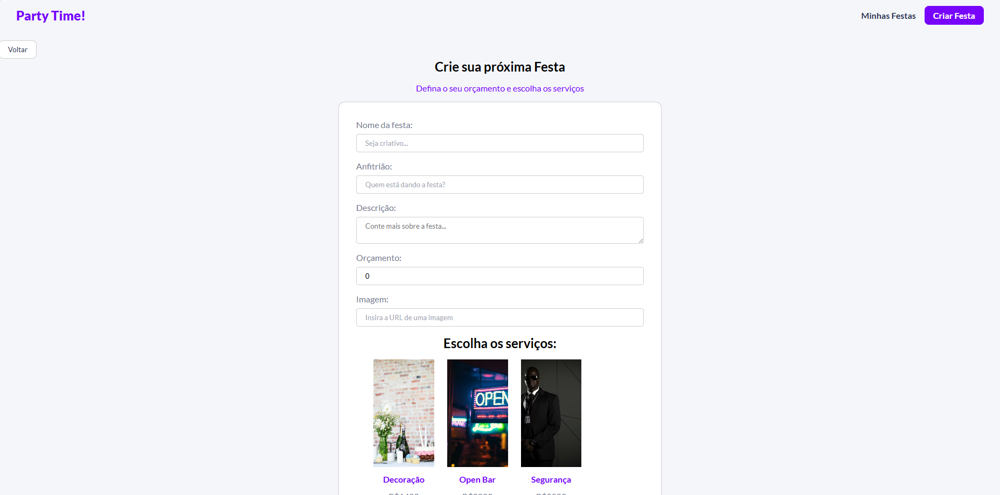
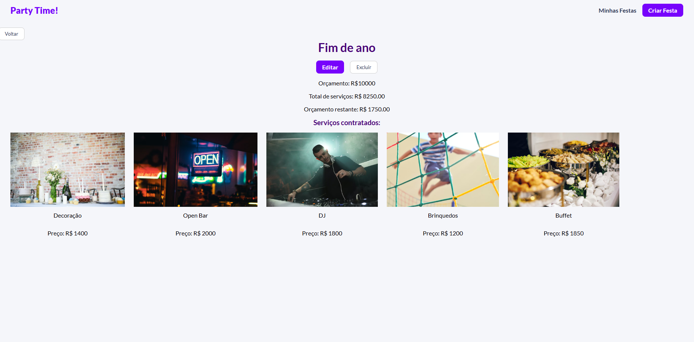

# 🎉 Party Time! — Full Stack (React + Node + MongoDB)

[](#)
[](#)
[](#)
[](#)
[](#)
[](#)

Aplicação full stack para **criar e gerenciar festas**, definindo **orçamento**, escolhendo **serviços contratados** (com preços e imagens) e acompanhando o **saldo do orçamento** (orçamento − total dos serviços).


## 🧾 Sobre o projeto

O **Party Time!** simula um sistema de planejamento de festas: você cadastra uma festa com um orçamento e seleciona serviços (buffet, fotógrafo, DJ etc.). O sistema exibe os serviços contratados e calcula automaticamente o **valor total gasto** e o **orçamento restante**.


## ✨ Funcionalidades

### 🎭 Festas
- Criar festa (título, anfitrião, descrição, orçamento, imagem e serviços)
- Listar festas
- Ver detalhes da festa
- Editar festa (incluindo serviços)
- Excluir festa

### 🧰 Serviços
- Listar serviços disponíveis (nome, imagem, preço)
- Cadastrar/atualizar/remover serviços via API

### 💰 Cálculo de orçamento
- Soma dos serviços contratados
- Exibição do **orçamento restante**
- Destaque quando o orçamento fica negativo (opcional)


## 🖼️ Prints do sistema 




## 🧠 Arquitetura (como funciona)

- **Front-end (React/Vite)** consome a API usando **Axios**.
- **Back-end (Node/Express)** expõe endpoints REST em `/api`.
- **MongoDB (Atlas/Local)** armazena festas e serviços com **Mongoose**.
- Rotas principais:
  - `/api/services` → serviços disponíveis
  - `/api/parties` → CRUD de festas


## 🧰 Tecnologias

### Front-end
- React + Vite
- React Router DOM
- Axios
- Notificações (Toast)

### Back-end
- Node.js
- Express
- CORS
- MongoDB + Mongoose
- Nodemon

## 🔌 Endpoints da API (principais)

Base URL: `http://localhost:3000/api`

### Services
- `GET /services` → lista serviços
- `POST /services` → cria serviço
- `GET /services/:id` → detalhes do serviço
- `PUT /services/:id` → atualiza serviço
- `DELETE /services/:id` → remove serviço

### Parties
- `GET /parties` → lista festas
- `POST /parties` → cria festa
- `GET /parties/:id` → detalhes da festa
- `PUT /parties/:id` → atualiza festa
- `DELETE /parties/:id` → remove festa

## ▶️ Como rodar localmente

> Use **2 terminais**: um para o backend e outro para o frontend.

### 1) Back-end
```bash
cd backend
npm install
npm run start
```
### 2) Front-end
```bash
cd frontend
npm install
npm run dev